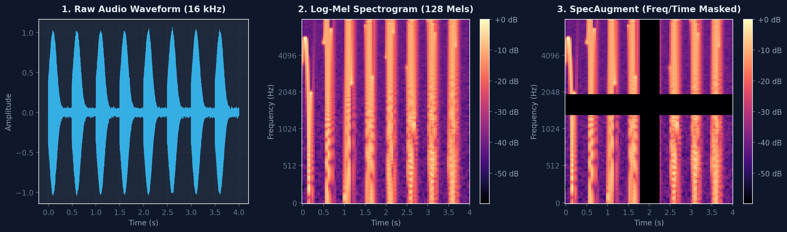
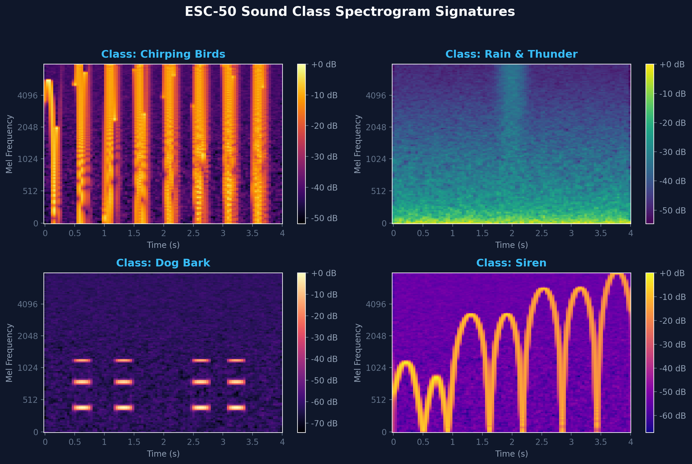

# 🎵 ESC-50 Audio Classifier

[](#-model-architecture)
[](https://www.python.org/)
[](https://pytorch.org/)
[](https://librosa.org/)
[](https://fastapi.tiangolo.com/)
[](https://modal.com/)

A concise, end-to-end Environmental Sound Classifier trained on the **ESC-50** dataset (50 classes) achieving **82% test accuracy**. It converts raw audio waveforms into **Log-Mel Spectrograms** to perform sound recognition using a 2D Convolutional Neural Network (CNN).

---

## 📊 Audio Processing Pipeline

Raw audio (16 kHz mono) is converted into **128-bin Mel Spectrograms** (`hop_length=625`) and augmented using **SpecAugment** (Frequency & Time Masking), Gaussian noise addition, and random time shifting.



---

## 🎨 Sound Spectrogram Signatures

Mel Spectrogram signatures across 4 distinct environmental audio classes:



---

## 🧠 Model Architecture

```
Input (1x128x128 Log-Mel Spectrogram)
  │
  ├──► Conv2D(1   ➔ 32,  3x3) + BatchNorm + ReLU + MaxPool2D(2x2)
  ├──► Conv2D(32  ➔ 64,  3x3) + BatchNorm + ReLU + MaxPool2D(2x2)
  ├──► Conv2D(64  ➔ 128, 3x3) + BatchNorm + ReLU + MaxPool2D(2x2)
  └──► Conv2D(128 ➔ 256, 3x3) + BatchNorm + ReLU + MaxPool2D(2x2)
  │
  ├──► AdaptiveAvgPool2D((1,1))
  ├──► Dropout(p=0.5)
  └──► Linear(256 ➔ 50) ──► Logits
```

- **Accuracy:** **82%** Test Accuracy
- **Parameters:** ~401K trainable parameters
- **Optimizer:** Adam (`lr=1e-3`, `weight_decay=4e-4`)
- **Scheduler:** CosineAnnealingLR (`T_max=100`, `eta_min=1e-6`)

---

## 📁 Project Structure

```
.
├── api/
│   ├── best_model.pth    # Model checkpoint
│   ├── main.py          # FastAPI server
│   ├── mapping.txt       # Class target map (50 categories)
│   └── model.py         # AudioClassifier CNN definition
├── assets/              # Spectrogram visualization figures
├── dataset.py           # ESC50Dataset class & audio transforms
├── get_data.py          # ESC-50 dataset downloader
├── train_modal.py       # Cloud GPU (Modal) training script
├── eda.ipynb            # Data exploration notebook
└── test.ipynb           # Testing notebook
```

---

## 🚀 Usage

### 1. Download Dataset
```bash
python get_data.py
```

### 2. Train Model on Cloud GPU (Modal)
```bash
modal run train_modal.py
```

### 3. Run Inference API
```bash
cd api
uvicorn main:app --reload
```

### 4. Send Prediction Request
```bash
curl -X POST "http://127.0.0.1:8000/predict" \
     -F "file=@sample.wav"
```

Output:
```json
{
  "prediction": "dog"
}
```
